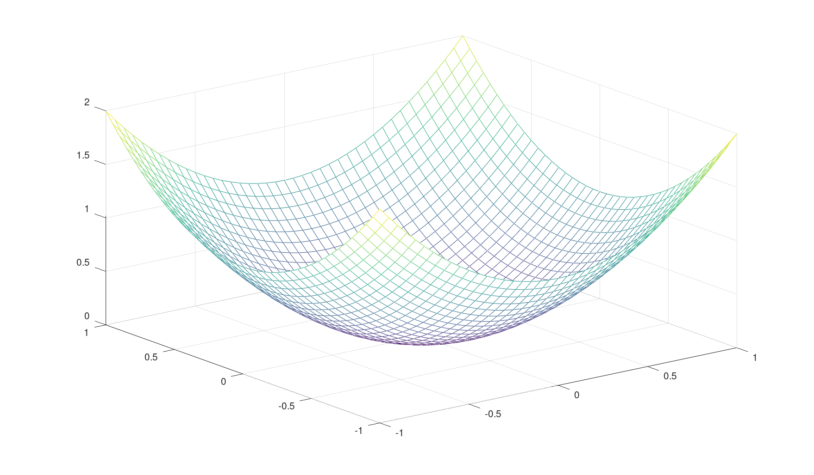

# Gradient Descent Optimizer

Gradient Descent Optimizer library with different line search/step size techniques.

## Install 

#### Compile the static library
```console
$ git clone https://github.com/KBaur/Optimizer.git
$ cd ./Optimizer/build
$ sudo bash ./build_and_install_lib.sh
```
[Folder](build/build_and_install_lib.sh)

## Platforms
 * Linux
 * Windows
 * macOS

## Features
* Simple to use Gradient Descent Optimizer
* Armijo Line Search
* Constant Step Size
* Strong Wolfe Search
 
## Usage samples

#### Basic usage
```c++
#include <iostream>
#include <vector>
#include <sstream>
#include <fstream>
#include <assert.h>

#include <ArmijoLineSearch.hpp>
#include <ConstantStepSize.hpp>
#include <StrongWolfeSearch.hpp>
#include <GradientDescent.hpp>

int main(int argc, char ** argv)
{
    //Minimum at zero
    auto paraboloid = [](std::vector<double> p_parameter)->double
    {
        return p_parameter.at(0)*p_parameter.at(0)+p_parameter.at(1)*p_parameter.at(1);
    };


    auto constantStepSize = std::shared_ptr<kb::math::ConstantStepSize<double>>(new kb::math::ConstantStepSize<double>(0.2));
    auto armijoLineSearch = std::shared_ptr<kb::math::ArmijoLineSearch<double>>(new kb::math::ArmijoLineSearch<double>());
    auto strongWolfe = std::shared_ptr<kb::math::StrongWolfeSearch<double>>(new kb::math::StrongWolfeSearch<double>());
    
    kb::math::GradientDescent<double> minimize;
    minimize.SetFunction(paraboloid);
    minimize.SetMaxIterations(1000);
    minimize.SetMinimumGradientLength(1e-6 );
    minimize.SetMinimumStepLength(1e-3);
    minimize.SetStepSizeFunction(armijoLineSearch);
    //minimize.SetStepSizeFunction(constantStepSize);
    //minimize.SetStepSizeFunction(strongWolfe);
    minimize.Minimize({-1.5,2.0});

    auto result = minimize.GetResult();

    std::cout << "==================" << std::endl;
    std::cout << "Armijo Line Search" << std::endl;
    std::cout << "==================" << std::endl;
    std::cout << "function value: " << result.m_result << std::endl;
    std::cout << "x: " << result.m_memberVariables.at(0) << " , y: " << result.m_memberVariables.at(1) << std::endl;
    std::cout << "iterations: " << result.m_iterations << std::endl;
    std::cout << "converged : " << (result.m_converged?"true":"false") << std::endl;
    std::cout << std::endl;
}
```

### Paraboloid


## Documentation

Doxygen documentation will be generated

---


